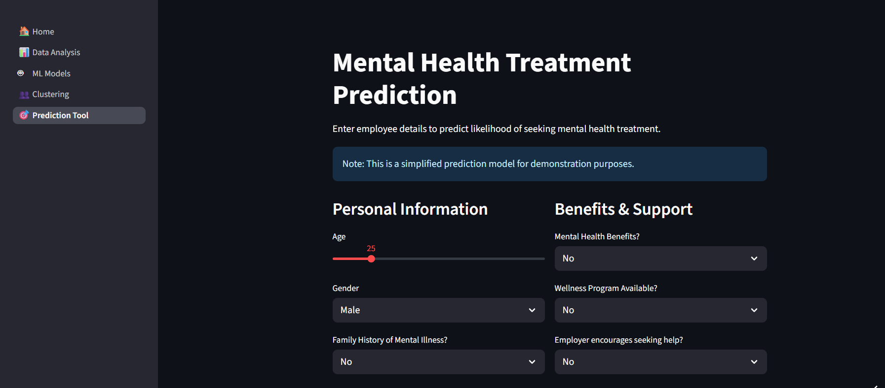

# Capstone Project 2025  
**Project Title:** Mental Wellness Analysis and Support Strategy  

---

## 🧾 Student Information  
- **Name:** Krrish Baghla  
- **Roll No.:** 24127025  
- **OpenLearn ID (OL ID):** OL-25-LP-058  

---

## 📝 Project Description  
This project aims to understand key factors influencing mental health among tech employees and build data-driven solutions for improving workplace well-being. It uses **machine learning techniques** to perform classification, regression, and clustering tasks and presents results via an **interactive Streamlit dashboard**.

### Objectives  
To understand the key factors influencing mental health issues among employees in the tech industry and build data-driven solutions for:  

1. **Classification Task:** Predict whether an individual is likely to seek mental health treatment.  
2. **Regression Task:** Predict the age of an individual based on personal and workplace attributes, supporting age-targeted intervention design.  
3. **Unsupervised Task:** Segment tech employees into distinct clusters based on mental health indicators to aid in tailored HR policies.  

---

## 🎯 Features  
- Data cleaning and preprocessing  
- Classification using ML models (Logistic Regression, Random Forest, etc.)  
- Regression model for age prediction  
- Clustering analysis for employee segmentation  
- Interactive **Streamlit dashboard** for visualization and insights  

---

## 📽 Demo  
**Streamlit App Demo:** [Click Here to View Demo](https://mental-health-survey-openlearn.streamlit.app/)  

---

## 📸 Screenshots  

---

## 🙏 Acknowledgements  
- **Dataset Source:** [Mental Health in Tech Survey](https://www.kaggle.com/datasets/osmi/mental-health-in-tech-survey+)  
- **Special Thanks:** The **OpenLearn 1.0 Pathfinders’ team** played a crucial role in this project. This would not have been possible without their guidance throughout the cohort.  

---
